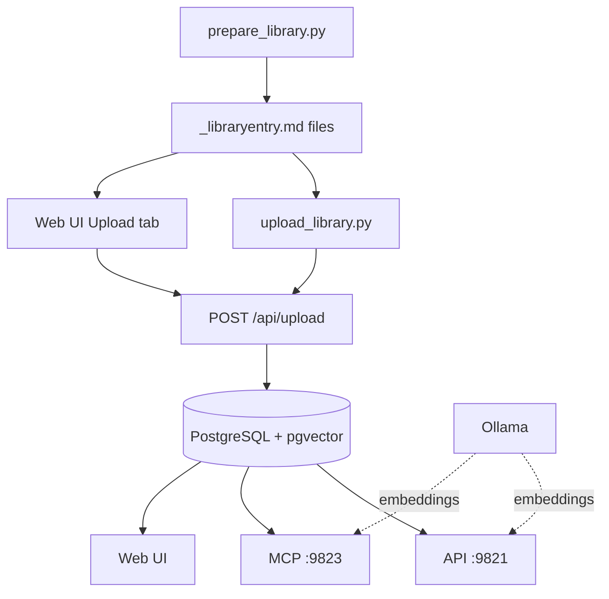

# Straight Library


A library browser exposing book metadata, summaries, and full texts via API, MCP, and Web UI. All data stored in PostgreSQL with pgvector for semantic search and full-text keyword search. Embeddings powered by Ollama.

## Architecture



- **API** (port 9821): FastAPI serving REST endpoints and the Web UI
- **MCP** (port 9823): FastMCP server with 6 tools for agents to browse, read, and search the library
- **PostgreSQL** (port 9822): All data — metadata, pre-paginated content, chapters, full-text search index (tsvector + GIN), and pgvector semantic embeddings
- **Ollama**: Local embedding model (`qwen3-embedding:0.6b`, 1024 dimensions) for vectorizing content

## Prerequisites

- Docker and Docker Compose
- **Ollama** running on the host with the embedding model pulled:
  ```bash
  ollama pull qwen3-embedding:0.6b
  ```

## Quick Start

```bash
# 1. Prepare library entry files from source data
python prepare_library.py

# 2. Start services (postgres, api, mcp)
docker compose up --build -d

# 3. Upload all entries via CLI
python upload_library.py

# 4. Open the Web UI
open http://localhost:9821
```

## API Endpoints

| Method | Path | Description |
|--------|------|-------------|
| `POST` | `/api/upload` | Upload a `_libraryentry.md` file |
| `GET` | `/api/entries` | List entries (paginated, filterable) |
| `GET` | `/api/entries/{id}/page` | Get a page of content |
| `DELETE` | `/api/entries/{id}` | Delete an entry and its embeddings |
| `GET` | `/api/search` | Keyword search across all content (PostgreSQL FTS) |
| `POST` | `/api/semantic-search` | Semantic vector search across fulltext chunks |
| `GET` | `/api/status` | Health check |

### Filters for `GET /api/entries`

`title`, `author`, `genre`, `tag` (substring match), `year_min`, `year_max`, `skip`, `limit`

### Query params for `GET /api/entries/{id}/page`

`section` (shortsummary, summary, fulltext), `page` (1-based)

### Query params for `GET /api/search`

`q` (search query), `entry_id` (optional), `section` (optional), `limit` (default 20, max 50)

Supports natural search syntax: simple keywords, `"exact phrases"`, `OR`, and `-negation`.

### Body for `POST /api/semantic-search`

```json
{
  "query": "the meaning of consciousness",
  "entry_id": null,
  "section": null,
  "limit": 10
}
```

Returns semantically related fulltext chunks with `entry_id`, `title`, `author`, `section`, `page_number`, `chunk_index`, and `snippet`. Each result points to a specific page readable via `GET /api/entries/{id}/page`.

## MCP Tools

Connect via streamable-http at `http://localhost:9823`.

| Tool | Description |
|------|-------------|
| `list_entries` | Browse and filter the library catalog with pagination |
| `get_entry` | Get a book's metadata and table of contents (chapter headings with page numbers) |
| `get_page` | Read a single page (~1000 tokens) of a section |
| `get_pages` | Read up to 10 consecutive pages in one call |
| `search_content` | Keyword search with PostgreSQL FTS (words, phrases, OR, negation) |
| `semantic_search` | Semantic vector search for conceptually related content (thematic, paraphrased, multilingual) |

## Configuration

| Variable | Default | Description |
|----------|---------|-------------|
| `PAGE_MAX_CHARS` | `4000` | Max characters per page (~1000 tokens) |
| `API_PORT` | `9821` | API service port |
| `MCP_PORT` | `9823` | MCP service port |
| `POSTGRES_PORT` | `9822` | PostgreSQL/pgvector port |
| `POSTGRES_USER` | `libraryuser` | PostgreSQL username |
| `POSTGRES_PASSWORD` | `librarypassword` | PostgreSQL password |
| `POSTGRES_DB` | `librarydb` | PostgreSQL database name |
| `OLLAMA_EMBED_MODEL` | `qwen3-embedding:0.6b` | Ollama embedding model name |
| `EMBEDDING_DIMENSION` | `1024` | Embedding vector dimension |
| `CHUNK_SIZE` | `1000` | Characters per text chunk for embedding |
| `CHUNK_OVERLAP` | `100` | Overlap between adjacent chunks |

Copy `.env.example` to `.env` to customize.

## Library Entry Format

Each `_libraryentry.md` file has 4 sections separated by `---`:

```
---
title: Book Title
author: Author Name
publication_year: 2024
genre: Fiction
custom_tags:
- tag1
- tag2
---
Short summary content...
---
Detailed summary content...
---
Full text content...
```

### Required fields

- `title` and `author` are required in the YAML metadata block.
- `publication_year`, `genre`, and `custom_tags` are optional.

### Optional content sections

The **shortsummary** and **summary** sections may be left empty. The file still requires all four `---` separators, but sections between them can contain no text:

```
---
title: Minimal Entry
author: Some Author
---
---
---
Only full text here...
```

The page count for empty sections will be 0. The API, MCP, and Web UI all handle empty sections gracefully.

### Pagination

Pages are pre-split at upload time by aggregating paragraph blocks (separated by blank lines) up to `PAGE_MAX_CHARS` characters per page. Markdown headings (`# Heading`) are extracted as chapter markers and stored with their page numbers, enabling agents to navigate books by chapter.

### Chunking and Embedding

During upload, **fulltext pages** are further split into ~1000-character chunks with 100-character overlap using `RecursiveCharacterTextSplitter`. Each chunk is embedded via Ollama and stored in pgvector for semantic search. Shortsummary and summary sections are not embedded — they serve the reading workflow, providing token-efficient coherent overviews.

Embedding failures are non-fatal: if Ollama is unavailable, the PostgreSQL upload still succeeds and keyword search remains fully functional. Re-uploading an entry replaces its existing embeddings.
